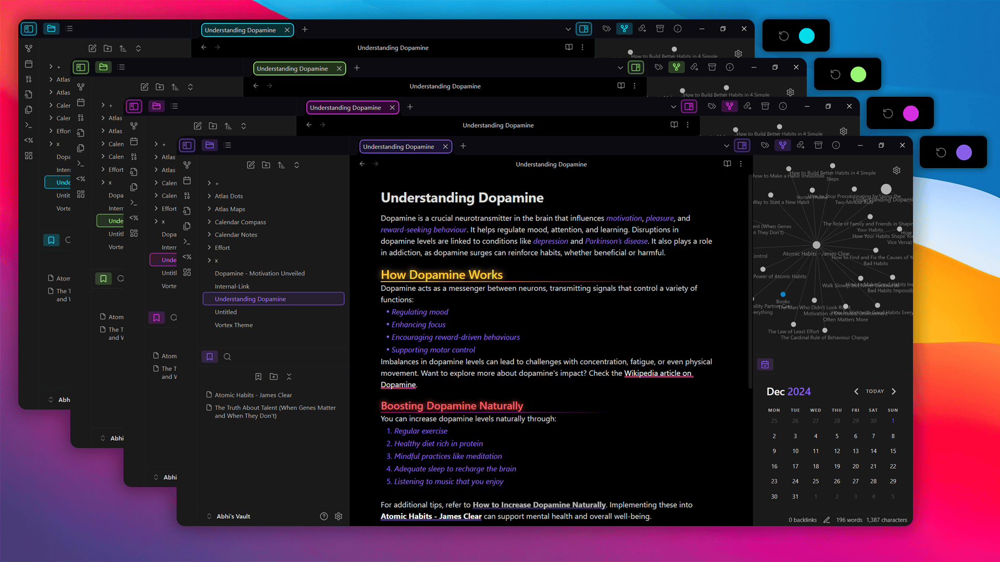
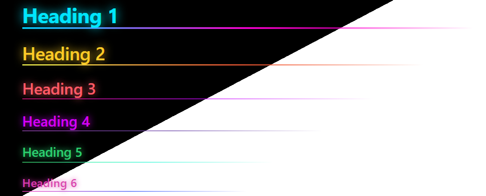
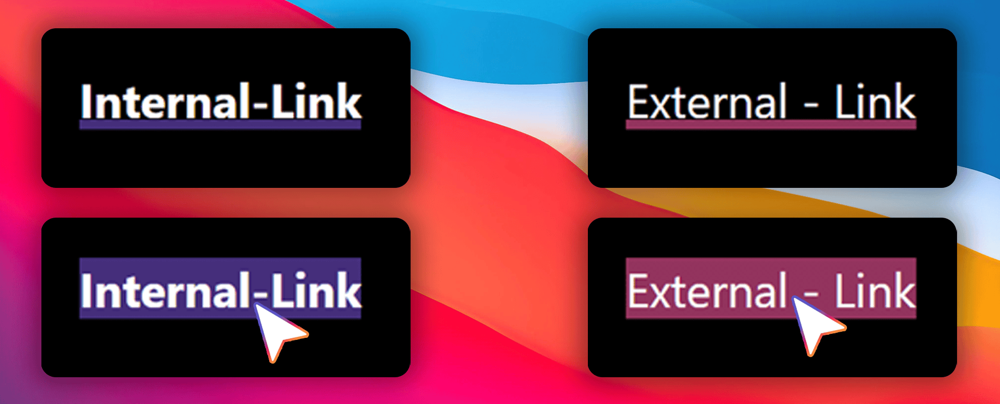
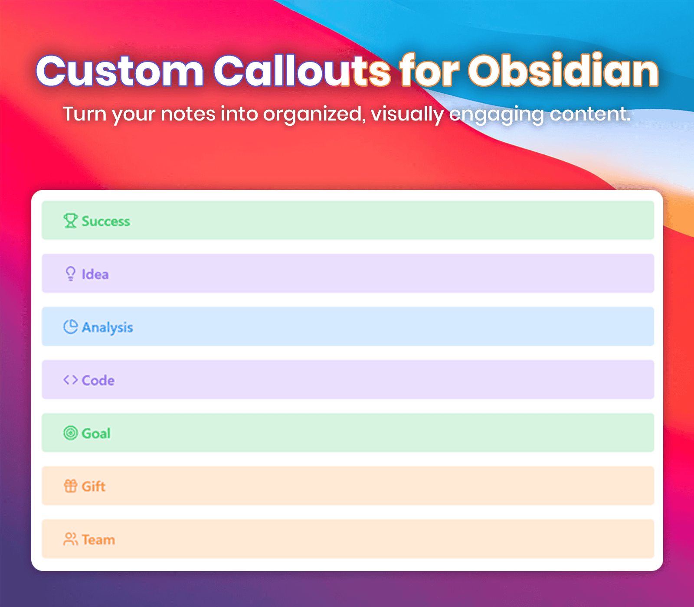
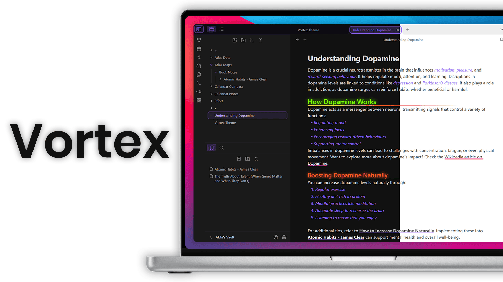
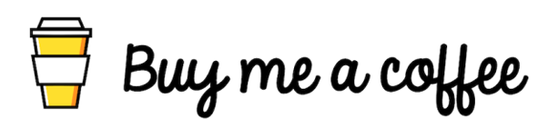

<h1 align="center">Vortex</h1>

<div align="center">
<strong>v1.0.2</strong> | Designed & Coded with ❤️ by <strong>Abhiman G S</strong>
</div>
<br>


## ✨ Features
- Infinite accent color customization.
- Neon glow and gradient underlines for headings.
- Smooth animations for links.
- Unique custom callouts with icons.
<!-- 
╔═══════════════════════════╗
║         COLOURS           ║
╚═══════════════════════════╝
-->
## 🎨 Multiple Theme Colors

Vortex lets you pick any accent color to match your style.  

### How to Change the Accent Color:
1. Open **Settings** in Obsidian.
2. Go to **Appearance**.
3. Find **Accent Color** with a color ring.
4. Pick your favorite color.

Everything in Obsidian updates to match the color you choose. It's a quick and easy way to personalize your theme.

See the image below for a demo of how it looks!



<!-- 
╔═══════════════════════════╗
║         HEADING           ║
╚═══════════════════════════╝
-->

## Heading Styling

#### Different Colors
Each heading level has its own color, making sections easy to tell apart.

#### Neon Glow
Headings have a glowing effect for a vibrant look.

#### Gradient Underline
Each heading has a custom gradient underline for extra style.



<!-- 
╔═══════════════════════════╗
║          LINKS            ║
╚═══════════════════════════╝
-->
## Link Styling and Animation

Internal and external links are styled with distinct colors for easy differentiation. 

- **Internal Links**: Use the theme’s primary color and point to content within the document.
- **External Links**: Have a unique color for external resources.

### Hover Effect
- A bottom border appears, rising to fill the background on hover, creating a smooth animation.

This effect adds interactivity and enhances the visual appeal of your notes.



<!-- 
╔═══════════════════════════╗
║        CALLOUTS           ║
╚═══════════════════════════╝
-->
## Custom Callouts Overview
Below is a list of **custom callouts** with their respective icons. You can use these callouts in your notes for better organization and visual aesthetics.
#### Example Usage:
```markdown
> [!Callout Name] Enter the Title
> [!success] Success Title
```

<details>
   <summary>Click to view all custom callouts</summary>
   <br>

- **`success`**: 🏆 Trophy  
- **`warning`**: 🛑 Octagon Alert  
- **`error`**: ⚠️ Triangle Alert  
- **`info`**: ℹ️ Info  
- **`quote`**: ❝ Quote  
- **`note`**: 📓 Notebook Pen  
- **`highlight`**: ✍️ Highlighter  
- **`idea`**: 💡 Lightbulb  
- **`task`**: ✅ Circle Check  
- **`reminder`**: 🔔 Bell Ring  
- **`analysis`**: 📊 Chart Pie  
- **`inspiration`**: 🌅 Sunrise  
- **`faq`**: ❓ Message Circle  
- **`code`**: 💻 Code  
- **`goal`**: 🎯 Target  
- **`celebration`**: 🎉 Party Popper  
- **`bug`**: 🐞 Bug  
- **`gift`**: 🎁 Gift  
- **`puzzle`**: 🧩 Puzzle  
- **`bookmark`**: 🔖 Bookmark  
- **`calendar`**: 📅 Calendar  
- **`team`**: 👥 Users  

</details>




# 🌟 Transform Your Notes with Vortex  
Vortex is a **lightweight theme** designed to make your notes visually stunning and highly customizable.  
### Why Choose Vortex?  
- **Smooth animations** for interactive links.  
- **Customizable colors** to match your style.  
- **Stylish callouts** for better organization.  

Elevate your note-taking experience with Vortex—the perfect blend of functionality and style!  



## ☕ Fuel My Code with a Coffee!
If you enjoy my projects, a small tip keeps me coding!

<a href="https://abhiman.lemonsqueezy.com/buy/47982b9f-ab2f-49c1-a11d-4dc364d5dfe6?discount=0">
  
</a>

## 🎉 Shoutout to Supporters
Special thanks to [@1amnotmad](https://github.com/1amnotmad) for their generous donation supporting the Obsidian Vortex theme!

## 🔧 Installation

1. Open **Settings** in Obsidian.
2. Go to **Appearance**.
3. Under **Community Themes**, search for "Vortex."
4. Click **Use** to apply the theme.

## 🐞 Found a Bug?
If you encounter any issues or have suggestions, please open an issue on the [GitHub repository](https://github.com/abhimangs/obsidian-vortex/issues).

<!-- Contact -->
## 🌐 Connect with Me
**Get in Touch:** Drop me a line at **[theabhimangs@gmail.com](mailto:theabhimangs@gmail.com)** for collabs, queries, or a quick hello!

[](mailto:theabhimangs@gmail.com)
[](https://www.linkedin.com/in/abhimangs)
[](https://www.instagram.com/theabhimangs)
[](https://www.threads.net/@theabhimangs)
[](https://bsky.app/profile/abhimangs.bsky.social)
[](https://www.reddit.com/user/abhimangs)
[](https://twitter.com/abhimangs)

### 📜 License

This theme is licensed under the [MIT License](LICENSE). Feel free to use, modify, and distribute it as per the license terms.

<h2>🙏 Special thanks to the Obsidian community for their support and inspiration.</h2>

<p align="center">
  
  
  
  
  
</p>

<p align="center">
   Made with ❤️ by <a href="https://github.com/abhimangs">Abhiman G S</a>
</p>
