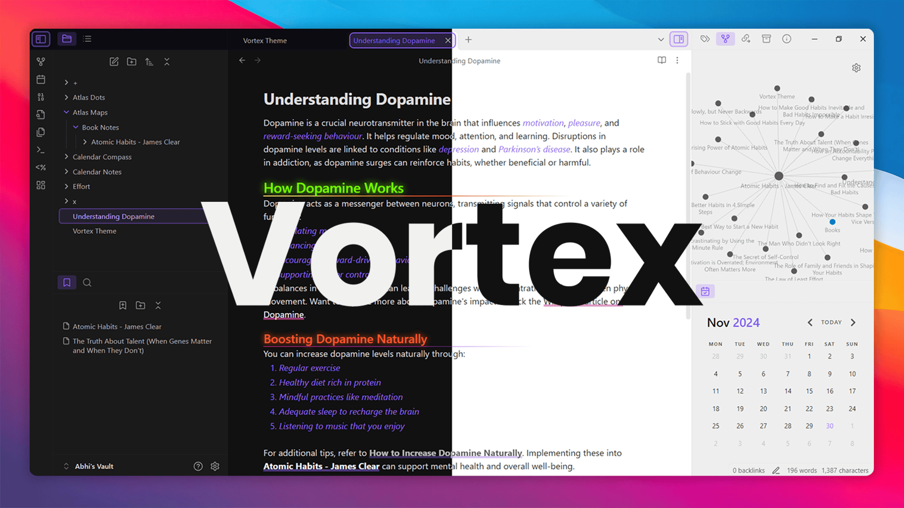
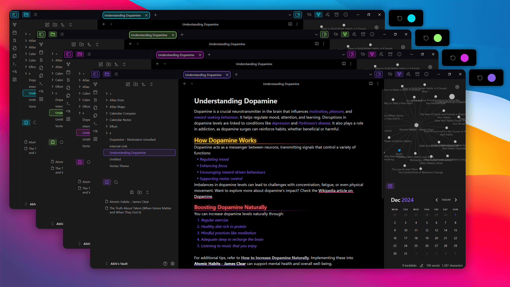
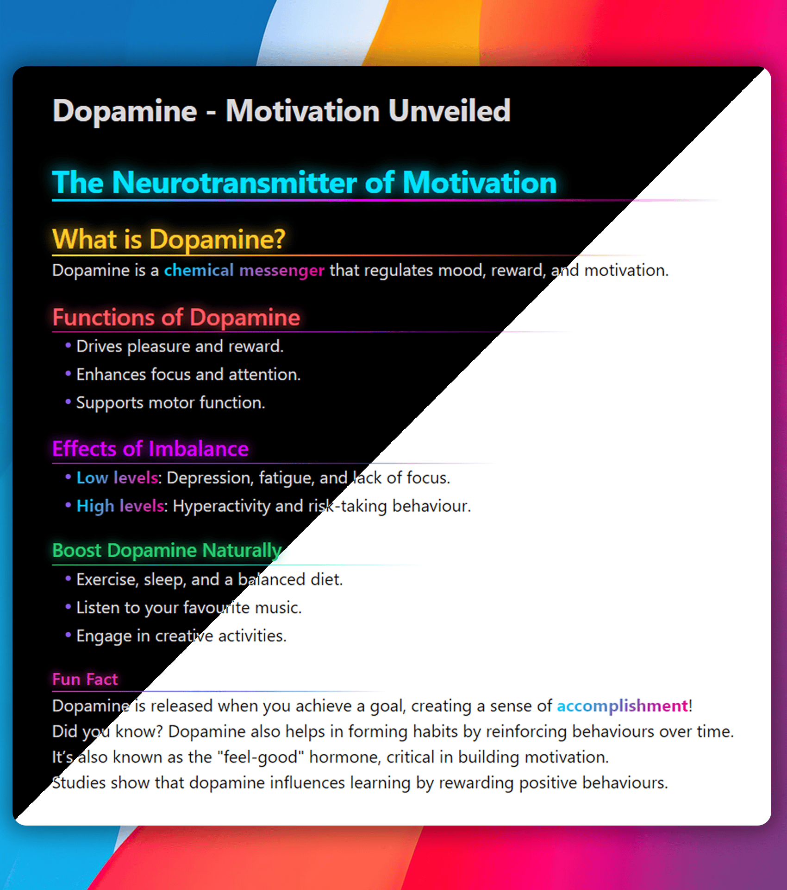
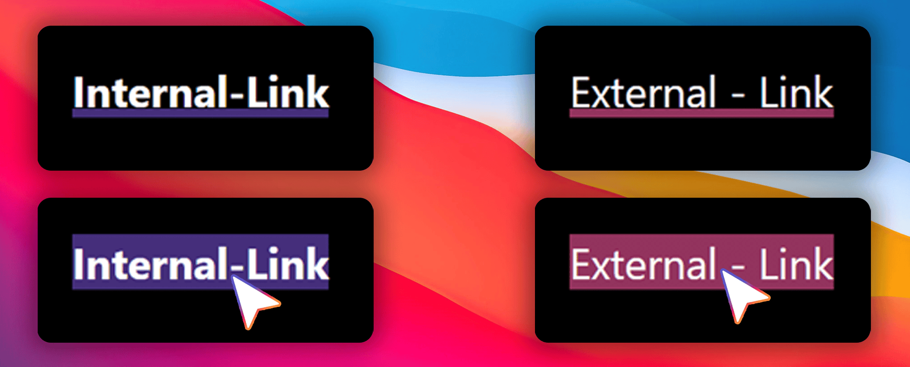
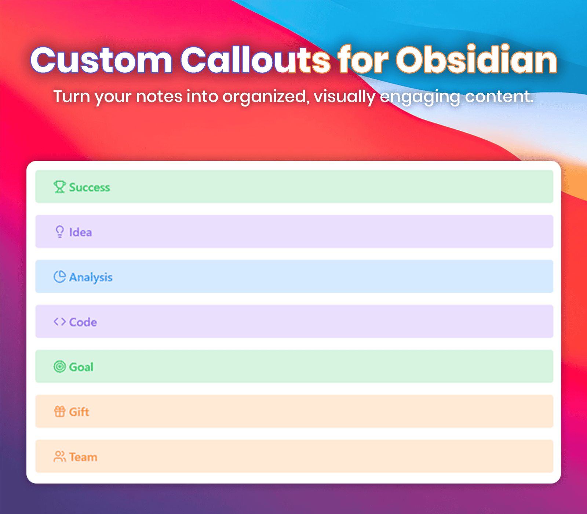

<h1 align="center">Vortex</h1>
<div align="center">
<strong>v1.0</strong> | Designed with ❤️ by <strong>Abhiman G S</strong>
</div>
<br>



## ✨ Features
- Infinite accent color customization.
- Neon glow and gradient underlines for headings.
- Smooth animations for links.
- Unique custom callouts with icons.
<!-- 
╔═══════════════════════════╗
║         COLOURS           ║
╚═══════════════════════════╝
-->
## 🎨 Multiple Theme Colors

Vortex lets you pick any accent color to match your style.  

### How to Change the Accent Color:
1. Open **Settings** in Obsidian.
2. Go to **Appearance**.
3. Find **Accent Color** with a color ring.
4. Pick your favorite color.

Everything in Obsidian updates to match the color you choose. It's a quick and easy way to personalize your theme.

See the image below for a demo of how it looks!



<!-- 
╔═══════════════════════════╗
║         HEADING           ║
╚═══════════════════════════╝
-->

## Heading Styling

#### Different Colors
Each heading level has its own color, making sections easy to tell apart.

#### Neon Glow
Headings have a glowing effect for a vibrant look.

#### Gradient Underline
Each heading has a custom gradient underline for extra style.



<!-- 
╔═══════════════════════════╗
║          LINKS            ║
╚═══════════════════════════╝
-->
## Link Styling and Animation

Internal and external links are styled with distinct colors for easy differentiation. 

- **Internal Links**: Use the theme’s primary color and point to content within the document.
- **External Links**: Have a unique color for external resources.

### Hover Effect
- A bottom border appears, rising to fill the background on hover, creating a smooth animation.

This effect adds interactivity and enhances the visual appeal of your notes.



<!-- 
╔═══════════════════════════╗
║        CALLOUTS           ║
╚═══════════════════════════╝
-->
## Custom Callouts Overview
Below is a list of **custom callouts** with their respective icons. You can use these callouts in your notes for better organization and visual aesthetics.
#### Example Usage:
```markdown
> [!Callout Name] Enter the Title
> [!success] Success Title
```
<details>
   <summary>Click to view all custom callouts</summary>
   <br>
   
| **Callout Name** | **Icon**                |
|-------------------|-------------------------|
| `success`         | 🏆 Trophy              |
| `warning`         | 🛑 Octagon Alert       |
| `error`           | ⚠️ Triangle Alert      |
| `info`            | ℹ️ Info                |
| `quote`           | ❝ Quote               |
| `note`            | 📓 Notebook Pen        |
| `highlight`       | ✍️ Highlighter        |
| `idea`            | 💡 Lightbulb           |
| `task`            | ✅ Circle Check        |
| `reminder`        | 🔔 Bell Ring           |
| `analysis`        | 📊 Chart Pie           |
| `inspiration`     | 🌅 Sunrise             |
| `faq`             | ❓ Message Circle      |
| `code`            | 💻 Code                |
| `goal`            | 🎯 Target              |
| `celebration`     | 🎉 Party Popper        |
| `bug`             | 🐞 Bug                 |
| `gift`            | 🎁 Gift                |
| `puzzle`          | 🧩 Puzzle              |
| `bookmark`        | 🔖 Bookmark            |
| `calendar`        | 📅 Calendar            |
| `team`            | 👥 Users               |
</details>



## 🔧 Installation

1. Open **Settings** in Obsidian.
2. Go to **Appearance**.
3. Under **Community Themes**, search for "Vortex."
4. Click **Use** to apply the theme.

## 🐞 Found a Bug?
If you encounter any issues or have suggestions, please open an issue on the [GitHub repository](https://github.com/abhimangs/obsidian-vortex/issues).

## 🚀 Stay Connected

### 💬 **Questions or Feedback?** Reach out via [GitHub Issues](https://github.com/abhimangs/obsidian-vortex/issues).
###### 🔗 **Connect with me:**  
-  [GitHub](https://github.com/abhimangs)  
-  [LinkedIn](https://www.linkedin.com/in/abhimangs/)
-  [X / Twitter](https://x.com/abhimangs)  
- 📧 Email: [theabhimangs@gmail.com](mailto:theabhimangs@gmail.com)

### 📜 License

This theme is licensed under the [MIT License](LICENSE). Feel free to use, modify, and distribute it as per the license terms.

## 🙏 Acknowledgments
Special thanks to the Obsidian community for their support and inspiration.
---

<p align="center">
  Made with ❤️ by <a href="https://github.com/abhimangs">Abhiman G S</a>
</p>
